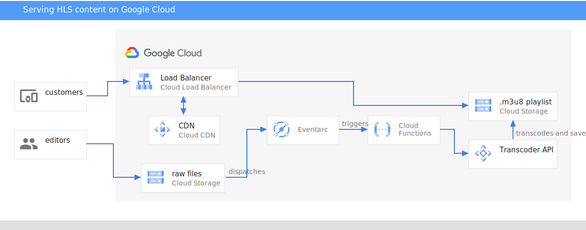

# hls-streaming-gcp

An example on how to setup a HLS transcoding pipeline on Google Cloud and stream it through a CDN to your mobile app

Instructions are on a tutorial which is going to be published soon.